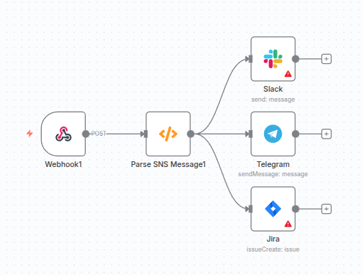

# AWS CloudWatch Alerts to Telegram/Slack/Jira Workflow

This project contains an **n8n** workflow that processes AWS SNS notifications from CloudWatch alarms and sends formatted alerts to Telegram and Slack, while creating issues in Jira. The workflow handles SNS subscription confirmations and parses alert data for reliable notifications.

## Project Overview



- **Purpose**: Automate AWS CloudWatch alarm notifications by integrating with SNS, formatting alerts, and distributing them to multiple platforms (Telegram, Slack, Jira).
- **Technologies**:
  - n8n (automation platform).
  - AWS SNS (input notifications).
  - Telegram, Slack, Jira APIs (output notifications).
- **Key Features**:
  - Receives SNS payloads via webhook.
  - Handles SNS subscription confirmations automatically.
  - Parses and formats CloudWatch alarm data (e.g., `AlarmName`, `NewStateValue`, `NewStateReason`).
  - Sends formatted messages to Telegram and Slack with Markdown.
  - Creates structured Jira issues for each alert.
  - Robust error handling for missing data or parsing failures.
- **Workflow ID**: `NbSrAo2W9seXv0d9`
- **n8n Version**: Compatible with versions supporting Function node and `$input` syntax (post-0.198.0).

## Workflow Structure

The workflow consists of four nodes:

1. **Webhook** → 2. **Parse SNS Message** → 3. **Telegram**, **Slack**, **Jira**

(Import `workflow.json` into n8n to visualize the flow.)

## Node Details

### 1. Webhook Node
- **Role**: Entry point for AWS SNS notifications.
- **Functionality**:
  - Listens for HTTP POST requests at `/sns-alert`.
  - Parses JSON payloads (e.g., SNS `Type`, `Message`, `TopicArn`).
  - Outputs `$json.body` to the next node.
  - Returns "OK" (HTTP 200) to acknowledge receipt.
- **Technical Details**:
  - Uses `n8n-nodes-base.webhook` (v1).
  - Path: `sns-alert`.
  - Ensures secure webhook handling via unique `webhookId`.
- **Parameters**:
  - `httpMethod`: "POST"
  - `path`: "sns-alert"
  - `options.responseData`: "OK"

### 2. Parse SNS Message Node
- **Role**: Processes SNS payloads, handles subscription confirmations, and formats alert data.
- **Functionality**:
  - Reads input via `$input.first().json.body`.
  - For `Type: "SubscriptionConfirmation"`, sends HTTP GET to `SubscribeURL`.
  - Parses `Message` field (string or object) into a JSON object.
  - Formats a Markdown string with alarm details (`AlarmName`, `NewStateValue`, `NewStateReason`) and emojis (🚨).
  - Outputs `{ formatted: <string>, raw: <object> }` for downstream nodes.
  - Includes error handling for missing body or JSON parsing issues.
- **Technical Details**:
  - Uses `n8n-nodes-base.function` (v1).
  - JavaScript code in `functionCode` uses Node.js `https` module for confirmations.
  - Fallbacks (`'N/A'`) ensure robustness for missing fields.
- **Parameters**:
  - `functionCode`: Custom JavaScript (see `workflow.json`).

### 3. Telegram Node
- **Role**: Sends formatted alert messages to a Telegram chat.
- **Functionality**:
  - Sends `$json.formatted` (Markdown string) to a specified chat.
  - Uses `parseMode: "MarkdownV2"` for proper rendering of bold text and emojis.
  - Authenticates via Telegram Bot API credentials.
- **Technical Details**:
  - Uses `n8n-nodes-base.telegram` (v1).
  - Relies on n8n’s retry mechanism for API failures.
- **Parameters**:
  - `chatId`: "12345676" (replace with your chat ID)
  - `text`: `{{ $json["formatted"] }}`
  - `additionalFields.parseMode`: "MarkdownV2"

### 4. Slack Node
- **Role**: Posts formatted alert messages to a Slack channel.
- **Functionality**:
  - Sends `$json.formatted` to a specified Slack channel.
  - Leverages Slack’s native Markdown support for bold text and emojis.
  - Authenticates via Slack Bot User OAuth Token.
- **Technical Details**:
  - Uses `n8n-nodes-base.slack` (v1).
  - Operation: `send`.
- **Parameters**:
  - `resource`: "message"
  - `operation`: "send"
  - `channel`: "C1234567890" (replace with your channel ID)
  - `text`: `{{ $json["formatted"] }}`

### 5. Jira Node
- **Role**: Creates a Jira issue for each alert with structured details.
- **Functionality**:
  - Creates an issue in a specified Jira project.
  - Uses `$json.raw` for structured fields (e.g., summary, description).
  - Summary: `<AlarmName> (<NewStateValue>)`.
  - Description: Includes `AlarmName`, `NewStateValue`, `NewStateReason`, `Timestamp` (with fallbacks).
  - Authenticates via Jira API credentials.
- **Technical Details**:
  - Uses `n8n-nodes-base.jira` (v1).
  - Operation: `issueCreate`.
- **Parameters**:
  - `resource`: "issue"
  - `operation`: "issueCreate"
  - `projectKey`: "PROJ" (replace with your project key)
  - `issueType`: "Task" (replace with your issue type)
  - `summary`: `{{ $json.raw.AlarmName }} ({{ $json.raw.NewStateValue }})`
  - `description`: Formatted alert details

---

## Test 1: Standard Alarm Notification
**Description:** Tests a CloudWatch alarm in ALARM state, sent to Telegram chat.

```bash
curl -X POST https://your-user.app.n8n.cloud/webhook-test/sns-alert \
  -H "Content-Type: application/json" \
  -d '{"Type":"Notification","MessageId":"a1b2c3d4-5678-9012-3456-789012345678","TopicArn":"arn:aws:sns:us-east-1:123456789012:CloudWatchAlerts","Subject":"ALARM: TestAlarm","Message":"{\"AlarmName\":\"TestAlarm\",\"NewStateValue\":\"ALARM\",\"NewStateReason\":\"Threshold breached for testing.\"}","Timestamp":"2025-10-01T13:28:00.123Z"}'
```


## Test 2: High CPU Utilization Alarm
**Description:** Tests a CloudWatch alarm for high CPU usage in ALARM state, sent to Telegram chat.

```bash
curl -X POST https://your-user.app.n8n.cloud/webhook-test/sns-alert \
  -H "Content-Type: application/json" \
  -d '{"Type":"Notification","MessageId":"b2c3d4e5-6789-0123-4567-890123456789","TopicArn":"arn:aws:sns:us-east-1:123456789012:CloudWatchAlerts","Subject":"ALARM: CPUUtilizationHigh","Message":"{\"AlarmName\":\"CPUUtilizationHigh\",\"NewStateValue\":\"ALARM\",\"NewStateReason\":\"CPU usage exceeded 80% for 5 minutes.\"}","Timestamp":"2025-10-01T13:32:00.456Z"}'
```


## Test 3: OK State Notification
**Description:** Tests a CloudWatch alarm returning to OK state, sent to Telegram chat.

```bash
curl -X POST https://your-user.app.n8n.cloud/webhook-test/sns-alert \
  -H "Content-Type: application/json" \
  -d '{"Type":"Notification","MessageId":"c3d4e5f6-7890-1234-5678-901234567890","TopicArn":"arn:aws:sns:us-east-1:123456789012:CloudWatchAlerts","Subject":"OK: DatabaseLatency","Message":"{\"AlarmName\":\"DatabaseLatency\",\"NewStateValue\":\"OK\",\"NewStateReason\":\"Database latency returned to normal (below 100ms).\"}","Timestamp":"2025-10-01T13:32:00.789Z"}'
```

